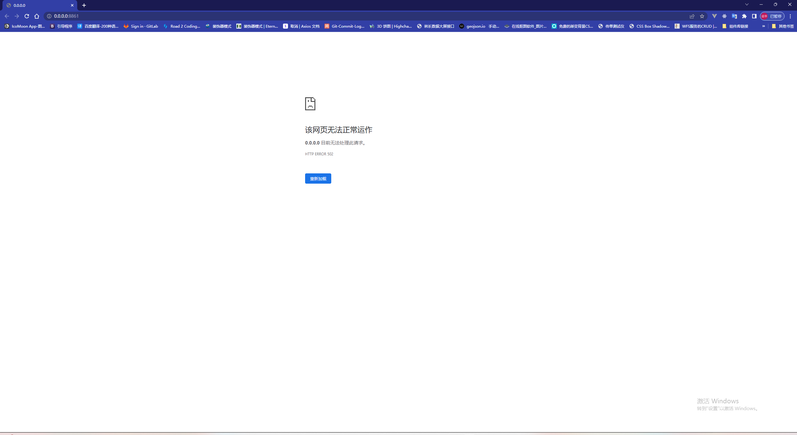
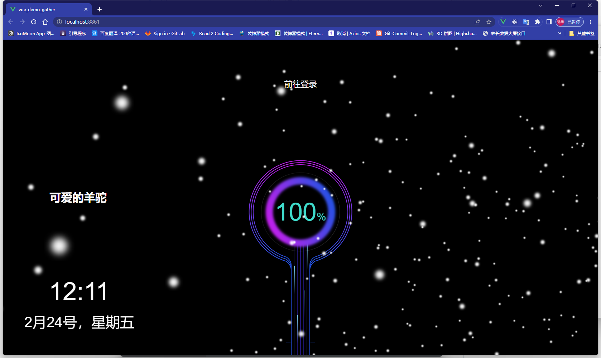
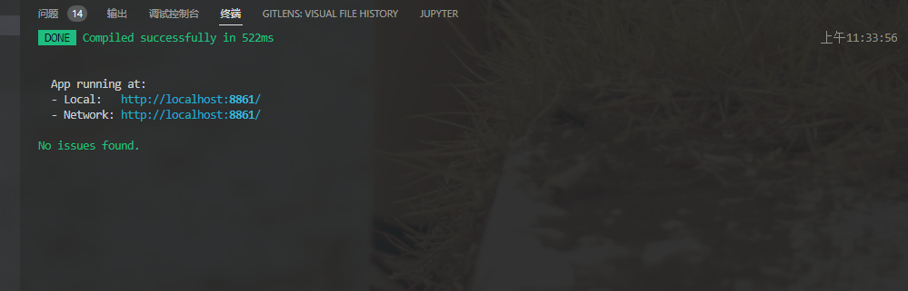
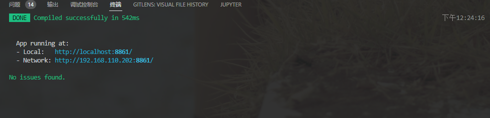

## Vue 项目启动默认打开 http://0.0.0.0:8080 ，浏览器无法访问

[vue-cli](https://so.csdn.net/so/search?q=vue-cli&spm=1001.2101.3001.7020) 5.x 版本 使用–open 时，默认打开浏览器，会出现 0.0.0.0:8080，浏览器显示无法访问

vue.config.js 配置

```js
devServer: {
    https: false,
    open: true,
    port: port,
    proxy: {},
  },
```



### 方案一

在 devServer 配置项中添加 host 为 localhost

```js
  devServer: {
    https: false,
    open: true,
    port: port,
    host: "localhost",
    proxy: {},
  },
```

或者在 package.json 中的启动命令添加--host localhost

这里设置的优先级更高

```pascal
  "scripts": {
    "serve": "vue-cli-service serve --host localhost",
  },
```

此时就可正常打开



但是也产生了新问题

App running at:

- Local: http://localhost:8861/
- Network: http://localhost:8861/



我们可以看到此时的两个地址是相同的

虽然这个方案解决了问题，但是也产生了新的问题，并不完美

所以有了第二个解决方案

### 方案二

在 vue.config.js 文件中配置进行如下配置

```js
const { defineConfig } = require('@vue/cli-service');
const port = process.env.port || 8861;
module.exports = defineConfig({
  transpileDependencies: true,
  lintOnSave: false, //关闭eslint 报错不影响编译 可选
  devServer: {
    https: false,
    open: {
      target: [`http://localhost:${port}`],
    },
    port: port,
    proxy: {},
  },
  publicPath: '/',
});
```

重新启动项目

成功打开页面

控制台输出地址正常



[Webpack](https://webpack.js.org/configuration/dev-server/#devserveropen)查看相关文档

[vue-cli](https://github.com/vuejs/vue-cli/issues/6834)
